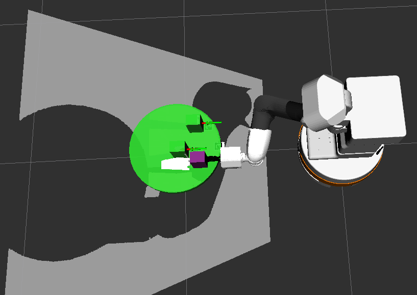
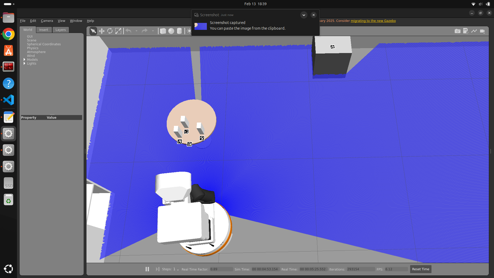

# 🦾 ROS2 Path Planning with TIAGo and MoveIt2

> Autonomous pick-and-place pipeline for the TIAGo robot using MoveIt2 motion
> planning, AprilTag detection, and ROS2 — simulated in Gazebo and orchestrated
> entirely with Docker Compose.

---

## 📋 Overview

This project implements a complete autonomous manipulation pipeline for the
**PAL Robotics TIAGo** robot in ROS2. The robot detects an object using
**AprilTag fiducial markers**, plans a collision-free arm trajectory using
**MoveIt2**, and executes a pick-and-place task fully autonomously in Gazebo
simulation.

A key aspect of this project is the **containerised development workflow** —
the entire robotics stack (TIAGo simulation, MoveIt2, AprilTag detection,
RViz, Gazebo) runs inside Docker containers orchestrated with Docker Compose.
My local ROS2 workspace is **volume-mounted** into the container, so code
changes take effect immediately without rebuilding the image.

Developed as part of the **Intelligent Robots (IKI)** course at
**RWU Hochschule Ravensburg-Weingarten**, Winter Semester 2025.

---

## 🖼️ Screenshots

| MoveIt2 Planning Scene | TIAGo with AprilTag Detection |
|:---:|:---:|
|  |  |

*Left: MoveIt2 planning sphere showing collision-free arm trajectory computed
for the TIAGo arm toward the target (purple cube). Right: TIAGo robot
detecting an AprilTag marker in Gazebo — camera feed routed from inside
the Docker container via X11 forwarding.*

---

## ✨ Features

- **AprilTag detection** — camera-based fiducial marker recognition using
  `apriltag_ros`, subscribing to TIAGo's head camera topic
  `/head_front_camera/rgb/image_raw` inside its own dedicated container
- **MoveIt2 motion planning** — collision-free trajectory planning for the
  TIAGo arm using the OMPL RRTConnect planner via a `moveit_wrapper` service
- **Pick-and-place pipeline** — full autonomous sequence: detect → plan →
  approach → grasp → lift, triggered via `moveit_wrapper_interfaces`
- **Gazebo object spawning** — target objects and AprilTag markers spawned
  programmatically via `spawn_objects_single.py` at container startup
- **Docker Compose orchestration** — multi-container architecture with
  separate services for simulation, MoveIt2, AprilTag, workspace, and RViz
- **Volume-mounted workspace** — local `ros2_ws` mounted into the container
  for live code editing without image rebuilds
- **X11 display forwarding** — Gazebo and RViz GUIs rendered from inside
  containers on the host display

---

## 🏗️ System Architecture

```
Host Machine (Ubuntu)
│
│  X11 Display forwarding (/tmp/.X11-unix volume)
│  Local workspace mounted → /root/ros2_ws (volume)
│
└── Docker Compose (tiago_moveit.yml)
        │
        ├── tiago_base container
        │     image: fbe-dockerreg.rwu.de/.../tiago_base:sim
        │     └── ros2 launch rwu_tiago_bringup sim_robocup_2023.launch.py
        │           └── Gazebo + TIAGo URDF + Nav2 + map
        │
        ├── moveit_wrapper container
        │     image: moveit_wrapper (GPU-enabled)
        │     └── MoveIt2 MoveGroup action server
        │           └── OMPL RRTConnect planner
        │
        ├── apriltag_detection container
        │     image: fbe-dockerreg.rwu.de/.../apriltag:humble
        │     └── apriltag_node
        │           ├── subscribes: /head_front_camera/rgb/image_raw
        │           └── publishes:  /tf (tag pose in camera frame)
        │
        ├── tiago_workspace container
        │     image: my_tiago_workspace (built from Dockerfile.tiago_workspace)
        │     ├── colcon build (moveit_wrapper_interfaces, moveit_wrapper_test)
        │     ├── spawn_objects_single.py  ← spawns object + AprilTag in Gazebo
        │     └── your pick-and-place code runs here
        │
        └── rviz container
              └── rviz2 -d /config/moveit2.rviz
```

---

## 🐳 Docker Compose Files

The project evolved from running **individual containers** per task to a
**unified multi-service Compose file**. Each yml file serves a specific purpose:

| File | Purpose |
|---|---|
| `tiago_moveit.yml` | **Main file** — full stack: sim + MoveIt2 + AprilTag + workspace |
| `tiago_sim.yml` | TIAGo simulation only (no navigation) |
| `tiago_nav.yml` | TIAGo simulation + Nav2 navigation with a pre-built map |
| `tiago_slam.yml` | TIAGo simulation + SLAM toolbox for map building |
| `tiago_inspection.yml` | Inspection scenario with custom obstacle spawning |
| `tiago_workspace.yml` | Workspace container built from custom Dockerfile |
| `moveit_demo.yml` | Standalone MoveIt2 demo (CPU and GPU variants) |
| `ros2-apriltag.yml` | AprilTag detection service (extended by tiago_moveit.yml) |
| `compose-tiago-demo.yml` | Minimal single-container TIAGo demo |

---

## 🛠️ Tech Stack

| Component | Technology |
|---|---|
| Robot platform | PAL Robotics TIAGo |
| Robot OS | ROS2 Humble |
| Simulation | Gazebo Classic |
| Motion planning | MoveIt2 + OMPL (RRTConnect planner) |
| Object detection | apriltag_ros (36h11 tag family) |
| Containerisation | Docker + Docker Compose |
| Container images | Pre-built images from RWU private registry |
| Workspace | Volume-mounted local `ros2_ws` into container |
| GUI forwarding | X11 socket forwarding (`/tmp/.X11-unix`) |
| Build system | colcon (inside container) |
| Language | Python 3 (rclpy) |

---

## 📁 Project Structure

```
tiago-moveit2-pathplanning/
├── docker/
│   ├── Dockerfile.tiago_workspace      # Custom workspace image
│   ├── tiago_moveit.yml                # Main compose — full stack
│   ├── tiago_sim.yml                   # Simulation only
│   ├── tiago_nav.yml                   # Sim + Nav2
│   ├── tiago_slam.yml                  # Sim + SLAM
│   ├── tiago_inspection.yml            # Inspection scenario
│   ├── tiago_workspace.yml             # Workspace container
│   ├── moveit_demo.yml                 # MoveIt2 standalone demo
│   ├── ros2-apriltag.yml               # AprilTag detection service
│   └── compose-tiago-demo.yml          # Minimal demo
├── src/
│   └── 25ws_sk-246767/
│       ├── models/
│       │   └── spawn_objects_single.py # Spawns object + tag in Gazebo
│       └── [your pick-and-place nodes]
├── config/
│   ├── tags_36h11.yaml                 # AprilTag configuration
│   └── moveit2.rviz                    # RViz MoveIt2 config
├── maps/
│   └── testmap.yaml                    # Pre-built Nav2 map
├── media/
│   ├── Nav2.png                        # MoveIt2 planning screenshot
│   └── gazebo_tiago.png                # Gazebo + AprilTag screenshot
├── README.md
└── .gitignore
```

---

## ⚙️ Prerequisites

- **Docker** and **Docker Compose** — [Install Docker](https://docs.docker.com/engine/install/ubuntu/)
  ```bash
  sudo apt install docker.io docker-compose-plugin
  sudo usermod -aG docker $USER   # run docker without sudo
  ```
- **NVIDIA Container Toolkit** (for GPU-accelerated MoveIt2 planning)
  ```bash
  sudo apt install nvidia-container-toolkit
  sudo systemctl restart docker
  ```
- **X11 display access** (for Gazebo and RViz GUI inside containers)
  ```bash
  xhost +local:docker
  ```
- **Access to RWU private Docker registry** —
  `fbe-dockerreg.rwu.de/prj-iki-ros2/`
  (requires RWU credentials — contact course supervisor)

> ℹ️ No manual ROS2 installation is needed. The entire ROS2 Humble stack,
> TIAGo packages, MoveIt2, and AprilTag run inside the pre-built Docker images
> pulled from the RWU registry.

---

## 🚀 Setup

### 1. Clone the repository

```bash
git clone https://github.com/Sammykrishna/tiago-moveit2-pathplanning.git
cd tiago-moveit2-pathplanning
```

### 2. Log in to the RWU Docker registry

```bash
docker login fbe-dockerreg.rwu.de
# Enter your RWU credentials
```

### 3. Pull the pre-built images

```bash
docker compose -f docker/tiago_moveit.yml pull
```

### 4. Allow X11 display forwarding

```bash
xhost +local:docker
```

---

## ▶️ Running the Full Stack

All services start with a single command using Docker Compose:

```bash
docker compose -f docker/tiago_moveit.yml up
```

This starts **4 containers simultaneously**:
- `tiago_base` — Gazebo simulation + TIAGo robot + Nav2
- `moveit_wrapper` — MoveIt2 MoveGroup action server (GPU-enabled)
- `apriltag_detection` — AprilTag node reading TIAGo's head camera
- `tiago_workspace` — builds your workspace and runs your code

Gazebo and RViz open automatically on your host display via X11 forwarding.

### Running individual scenarios

```bash
# Simulation only (no navigation)
docker compose -f docker/tiago_sim.yml up

# Simulation + Nav2 with pre-built map
docker compose -f docker/tiago_nav.yml up

# Simulation + SLAM (build a new map)
docker compose -f docker/tiago_slam.yml up

# Inspection scenario with obstacles
docker compose -f docker/tiago_inspection.yml up

# Standalone MoveIt2 demo (CPU)
DOCKER_IMAGE=humble-humble-tutorial-source docker compose -f docker/moveit_demo.yml run cpu

# Standalone MoveIt2 demo (GPU / NVIDIA)
DOCKER_IMAGE=humble-humble-tutorial-source docker compose -f docker/moveit_demo.yml run gpu
```

### Entering the workspace container

```bash
# Open a shell inside the running workspace container
docker exec -it tiago_workspace bash

# Inside the container — your workspace is already mounted
source /opt/ros/humble/setup.bash
cd /root/ros2_ws
source install/setup.bash

# Run your pick-and-place node
ros2 run your_package your_node
```

---

## 🔍 How It Works

### Step 1 — Container startup
`docker compose up` pulls/starts all containers. The `tiago_workspace`
container builds only the required packages using `colcon build --symlink-install`
and then runs `spawn_objects_single.py` to place the target object and
AprilTag marker in the Gazebo world.

### Step 2 — AprilTag detection
The `apriltag_detection` container runs `apriltag_node`, subscribing to
`/head_front_camera/rgb/image_raw` from TIAGo's head camera. Detected tag
poses are published to `/tf` in the camera frame. All containers share
`network_mode: host` so ROS2 topics flow between containers without extra
configuration.

### Step 3 — MoveIt2 planning
The `moveit_wrapper` container exposes a MoveIt2 action server. Your pick-and-place
node (running in `tiago_workspace`) sends a goal pose derived from the AprilTag
TF transform. MoveIt2 plans a collision-free trajectory using the OMPL
RRTConnect planner — visible as the green workspace sphere in RViz.

### Step 4 — Execution
The planned joint trajectory is executed on the TIAGo arm. The gripper
closes on the target object and lifts it to the post-grasp position.

---

## 🐳 What I Learned About Docker

Working with this containerised robotics stack taught me several key Docker concepts:

- **Multi-container orchestration** with Docker Compose — managing service
  dependencies, startup order, and shared networking across containers
- **Volume mounting** — mounting my local `ros2_ws` into the container so
  code changes were immediately reflected without rebuilding the image
- **X11 forwarding** — forwarding the host display socket
  (`/tmp/.X11-unix`) into containers to run Gazebo and RViz GUIs
- **Pre-built image workflow** — pulling specialised robotics images from a
  private registry instead of installing ROS2 dependencies manually
- **Service extension** — using Compose `extends` to reuse base service
  configurations across multiple yml files cleanly
- **GPU passthrough** — configuring NVIDIA runtime in Docker Compose for
  GPU-accelerated MoveIt2 planning (`nvidia-container-toolkit`)
- **`network_mode: host`** — enabling seamless ROS2 DDS topic sharing
  between containers and the host without manual port mapping
- **Iterative workflow** — started with individual single-container setups
  per task, then consolidated into a unified multi-service Compose file

---

## 🐛 Common Issues

| Problem | Cause | Fix |
|---|---|---|
| `Cannot connect to X server` | X11 forwarding not set up | Run `xhost +local:docker` before compose up |
| `pull access denied` from RWU registry | Not logged in | Run `docker login fbe-dockerreg.rwu.de` |
| RViz/Gazebo not opening | `DISPLAY` env var not passed | Check `DISPLAY=$DISPLAY` in compose environment section |
| MoveIt2 IK planning fails | Target pose outside workspace | Verify AprilTag pose is within TIAGo arm reach (~0.8m) |
| AprilTag not detected | Wrong camera topic name | Confirm topic is `/head_front_camera/rgb/image_raw` |
| Containers exit immediately | colcon build failed | Run `docker exec` into workspace container and check build logs |
| ROS2 topics not shared between containers | DDS discovery issue | Ensure all containers use `network_mode: host` and same `ROS_DOMAIN_ID` |

---

## 🔭 Future Work

- [ ] Deploy on real TIAGo hardware (replace sim images with hardware config)
- [ ] Replace AprilTag with deep learning-based 6DoF pose estimation
- [ ] Multi-object pick-and-place sequencing
- [ ] Integrate Nav2 — navigate to object location, then pick it up
- [ ] Add a `docker-compose.override.yml` for local development overrides
- [ ] Publish custom workspace image to registry for reproducible builds

---

## 👤 Author

**Samanth Krishna**
Master's student — Mechatronics Engineering
RWU Hochschule Ravensburg-Weingarten, Germany

[](https://github.com/Sammykrishna)

---

## 📄 License

MIT License — see [LICENSE](LICENSE) for details.

---

## 🙏 Acknowledgements

- **RWU Hochschule Ravensburg-Weingarten** — IKI course and Docker infrastructure
- [PAL Robotics](https://pal-robotics.com) — TIAGo robot platform
- [MoveIt2](https://moveit.ros.org) — motion planning framework
- [apriltag_ros](https://github.com/AprilRobotics/apriltag_ros) — AprilTag detection